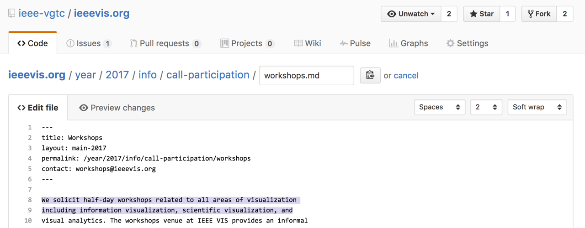
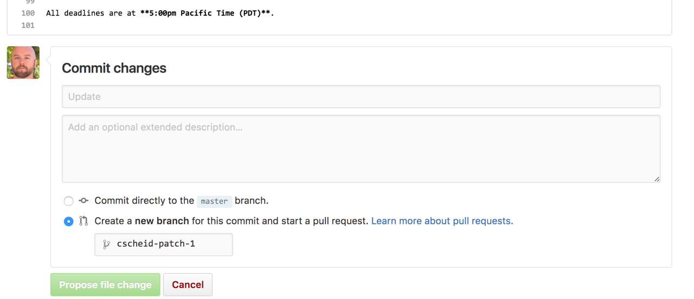
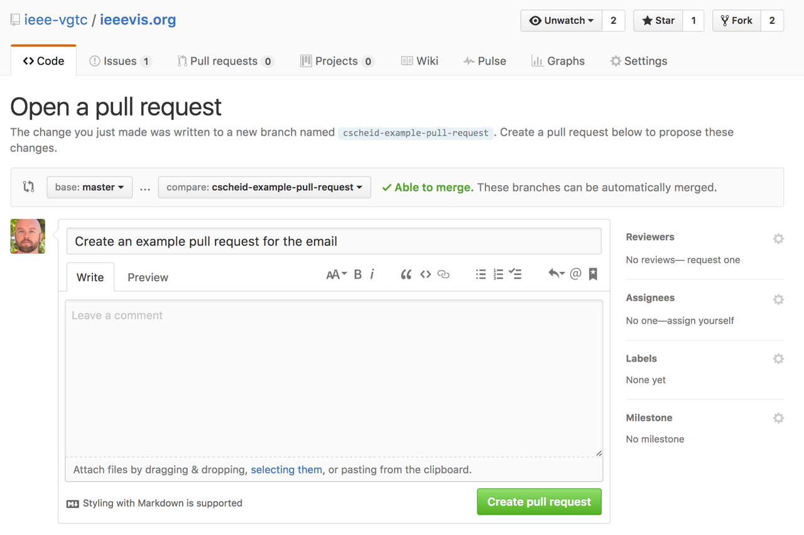
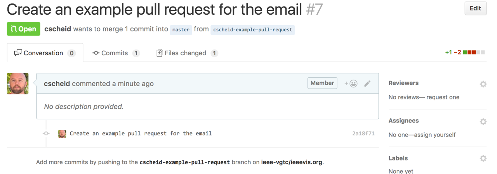

## How to change an existing page

The *easiest* way to suggest a change is to go on the bottom of the page you want to change and click on “file a bug”. You will be taken to the GitHub website where you can describe the problem, and web@ will get a notification when the bug is filed.

The *best* way to suggest a change is to go on the bottom of the page you want to change and click on “suggest a fix”. You will again be taken to GitHub. For this one you will be asked to log in to a GitHub account. After you do so, you will be shown an interface that looks like this:

After you’re done making the edits, you’ll go to the bottom of the page where there’s this:

After you click on “Propose file change”, you’ll be taken to something that looks like this, where you can click on “Create Pull Request":

After you click on that, web gets both a bug report and a proposed change:

If the change is simple, we’ll simply say “OK”. If the change requires reviewers, we can ask for people to comment on the thread. After everyone says OK, we merge the change and then we will be able to push it to staging.ieeevis.org

## Staging vs Production

In case you’re wondering how we go from staging.ieeevis.org to ieeevis.org, there is effectively no difference between staging and production. 

In other words, all of the discussion we've had here applies to production as well. 
(From our side, the difference between pushing to staging and pushing to production is "make staging" vs "make production").
